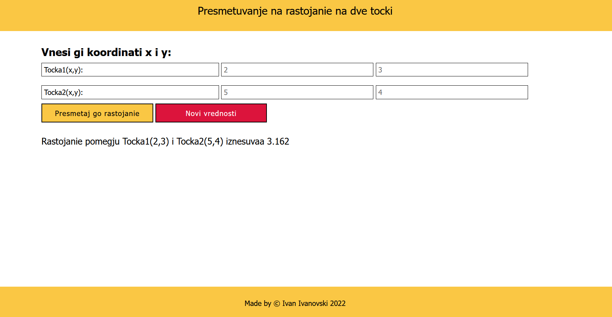

## Растојание помеѓу две точки

На сликите е прикажано како изгледа страница на кои корисникот може да внеси вредности за две точки, со кликање на дугмето Presmetaj rastojanie се пресметува растојание, а со кликање на дугмето Novi Vrednosti се овозможуваа корисникот да внесе нови вредности за точки, претходна содржина се пребришуваа

 

<h3>Fast link: https://rastojanie-pomedju-dve-tocki.netlify.app </h3>
